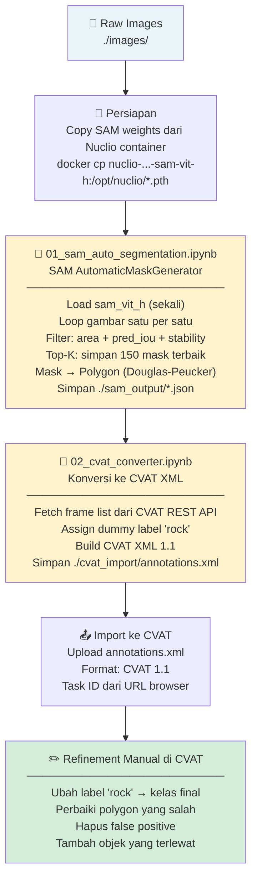

# Automatic Cutting Description

> AI-powered rock cutting description system using YOLO instance segmentation and SAM-assisted annotation.

---

## Overview

This project automates the classification and segmentation of rock cutting samples from drilling operations. It leverages **YOLOv12** for instance segmentation and **CVAT + SAM** for semi-automated annotation workflows.

### Key Features
- **Instance Segmentation** — Multi-class rock type detection using YOLOv12
- **SAM Integration** — Semi-automated annotation via CVAT + Segment Anything Model
- **Custom Callbacks** — Early stopping and model checkpoint management
- **Minority Class Augmentation** — Synthetic data generation for imbalanced datasets
- **Comprehensive Metrics** — Precision, Recall, F1, IoU evaluation via scikit-learn

---

## Project Structure

```
automatic-cutting-description/
├── README.md
├── requirements.txt
├── .gitignore
│
├── configs/                        # Training & model configuration
│   └── training_config.yaml
│
├── docs/                           # Documentation
│   ├── guides/
│   │   ├── CVAT_SAM_Installation_Guide.md
│   │   └── YOLO_Trainer_Guide.md
│   ├── reports/
│   │   └── CVAT_SAM_Debugging_Report.pdf
│   └── YOLO_Trainer_Structure.md
│
├── models/                         # Saved model weights (gitignored)
│
├── notebooks/                      # Jupyter Notebooks
│   ├── training/
│   │   ├── YOLO_Trainer.ipynb           # Main training notebook
│   │   └── YOLO_Trainer_Original.ipynb  # Reference/baseline notebook
│   ├── evaluation/
│   │   └── Independent_Evaluator.ipynb  # Model evaluation & metrics
│   └── exploration/
│       ├── YOLO_Visualizer.ipynb              # Training visualization & comparison
│       ├── 01_sam_auto_segmentation.ipynb     # SAM automatic mask generation
│       └── 02_cvat_converter.ipynb            # Convert SAM output → CVAT XML
│
├── scripts/                        # Utility scripts
│   ├── data_preprocessing/
│   │   ├── coco_polygon_simplification.py
│   │   ├── convert_coco_to_yolo.py
│   │   └── redistribute_dataset.py
│   ├── data_analysis/
│   │   ├── get_statistics_data.py
│   │   ├── minority_class_extractions.py
│   │   └── minority_class_generator.py
│   └── deployment/
│       ├── cvat-start.sh
│       └── cvat-stop.sh
│
└── src/                            # Core source code
    └── inference.py                # Inference pipeline
```

---

## Quick Start

### 1. Install Dependencies

```bash
pip install -r requirements.txt
```

### 2. Configure Training

Edit `configs/training_config.yaml` or set parameters directly in the notebook:

```yaml
version: "C_2026_1d80_10_10_AUG"
runner_name: "YOLOv12m_RG_Latest"
target_epochs: 150
batch_size: 6
img_size: 960
patience: 50
model: "yolov12m-seg.pt"
```

### 3. Run Training

Open `notebooks/training/YOLO_Trainer.ipynb` and click **Run All Cells**.

---

## Semi-Automatic Labeling Workflow

Proses anotasi menggunakan SAM di luar CVAT untuk efisiensi pada gambar dengan 100+ objek:



> Panduan lengkap: [SAM Semi-Automatic Annotation Guide](docs/guides/sam_autoannotation.md)

---

## Data Pipeline

```
Raw Images + CVAT Annotation
        ↓
scripts/data_preprocessing/convert_coco_to_yolo.py   (COCO → YOLO format)
        ↓
scripts/data_preprocessing/redistribute_dataset.py   (train/val/test split)
        ↓
scripts/data_analysis/get_statistics_data.py          (class balance check)
        ↓
scripts/data_analysis/minority_class_extractions.py  (extract minority classes)
        ↓
scripts/data_analysis/minority_class_generator.py    (synthetic augmentation)
        ↓
notebooks/training/YOLO_Trainer.ipynb                (model training)
        ↓
notebooks/evaluation/Independent_Evaluator.ipynb     (evaluation & metrics)
```

---

## Rock Classes

| ID | Class Name               | Category  |
|----|--------------------------|-----------|
| 0  | Siltstone                | Clastic   |
| 1  | Loose Sand               | Clastic   |
| 2  | Sandstone                | Clastic   |
| 3  | Limestone                | Carbonate |
| 4  | Loose Sandy and Silt     | Clastic   |
| 5  | Loose Silt               | Clastic   |
| 6  | Loose Limestone          | Carbonate |
| 7  | Coal                     | Organic   |

---

## Model

- **Architecture:** YOLOv12m-seg (instance segmentation)
- **Input Size:** 960×960
- **Task:** Multi-class instance segmentation

---

## Documentation

| Document | Description |
|----------|-------------|
| [YOLO Trainer Guide](docs/guides/YOLO_Trainer_Guide.md) | Training workflow & configuration |
| [CVAT + SAM Installation Guide](docs/guides/CVAT_SAM_Installation_Guide.md) | Annotation toolchain setup || [SAM Semi-Automatic Annotation Guide](docs/guides/sam_autoannotation.md) | Pipeline SAM → CVAT untuk anotasi massal || [YOLO Trainer Structure](docs/YOLO_Trainer_Structure.md) | Notebook architecture reference |

---

## Requirements

- Python ≥ 3.9
- CUDA-capable GPU (≥ 8GB VRAM recommended)
- See `requirements.txt` for full dependency list
